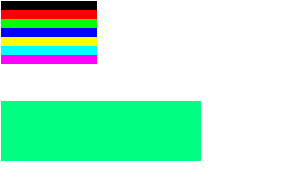
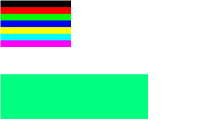
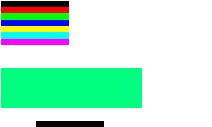
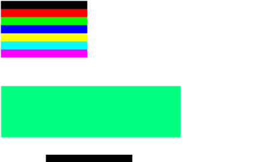

# Does an image scale with the cell?

`insert_image` sizes an image against `m_cell_width_unscaled` - the cell VTE
reports over the PTY, which the sixel producer used to decide how many pixels
to send - while `draw_images` sizes the destination against `m_cell_width`, the
cell after a zoom. If those two ever disagree by something other than the zoom,
the image is drawn at the wrong size, and no unit test can see it: the wrong
size is still a perfectly well-formed rectangle in the data structures.

So this measures the pixels. The law, in device pixels of a captured frame:

    drawn width = image width in sixel pixels x device scale x font zoom

Both factors, neither counted twice. A sixel pixel is a LOGICAL pixel that the
toolkit then blows up by the device scale, and the zoom scales the image
exactly as it scales the text around it.

## Running it

```sh
perf/scale-render/run.sh          _b/src/app/vte-2.91      /tmp/scale
perf/scale-render/run-wayland.sh  _b4/src/app/vte-2.91-gtk4 /tmp/scale-wl
```

Each runner captures a frame per configuration and hands the directory to
`measure.py`, which prints the table below and exits non-zero if the law does
not hold. The fixture is `child.sh`: the image at the origin, a 20x3 cell
marker block in a colour the image does not contain, and a second copy of the
image five cells right. The marker is how the harness learns the cell size FROM
THE PIXELS rather than assuming a font metric, and the second copy is the only
thing in the frame that can tell a cell-aligned placement from a lucky one -
an image sized against one cell and positioned against another still lands on
the origin.

The font zoom is measured, not assumed. A font does not promise that twice the
size is twice the metric: Monospace 12 doubled measures 20x39 on GTK3 here, not
20x40, so the image must scale by 39/20 vertically and 20/10 horizontally. A
harness that assumed 2.0 would report a rounding as a defect.

## Measured on this tree

GTK3, X11 under Xvfb, `Monospace 12`, cairo:

    config         cell     device  zoom       width   band top  band height
    gdk1           10x20    1       1.00x1.00   96 px   54 px      9 px
    gdk2           20x40    2       1.00x1.00  192 px  109 px     17 px
    gdk2-dpi0.75   16x30    2       1.00x1.00  192 px  109 px     17 px
    zoom1.5        15x30    1       1.50x1.50  144 px   81 px     13 px
    zoom2          20x39    1       2.00x1.95  192 px  106 px     17 px

GTK4, X11 under Xvfb, same font, GSK cairo renderer:

    config         cell     device  zoom       width   band top  band height
    gdk1           10x19    1       1.00x1.00   96 px   54 px      9 px
    gdk2           20x38    2       1.00x1.00  192 px  109 px     17 px
    gdk2-dpi0.75   20x38    2       1.00x1.00  192 px  109 px     17 px
    zoom1.5        14x29    1       1.40x1.53  134 px   83 px     13 px
    zoom2          19x38    1       1.90x2.00  182 px  109 px     17 px

GTK4 on a headless Wayland output (sway, wlroots pixman), where a FRACTIONAL
scale is possible at all:

    config         cell            device  zoom       width   band top   band height
    wl1            10x19           1       1.00x1.00   96 px   54 px       9 px
    wl1.5          14.95x28.3333   1.5     1.00x1.00  143 px   80.6667 px 13 px
    wl2            20x38           2       1.00x1.00  192 px  109 px      17 px

The magenta band is 96 sixel pixels wide and starts 54 pixels down, so the
expected extents are `96 x scale` and `54 x scale`: 192 and 108 at 2, 144 and
81 at 1.5. Every measured value is within one device pixel of that. The band
edges lose their outermost row to resampling - 17 px where 18 is exact - which
is why the tolerance is one pixel and not zero.

Two things the table says that are easy to get wrong:

- **`gdk2-dpi0.75` is not a 1.5x image**, and it is not meant to be. X11's only
  approximation of a fractional scale is a 2x surface with the font at three
  quarters, so the emulated sixel cell shrinks with the font and the image
  keeps its 2x pixel size while covering 12 columns where it covered 9.6. That
  is correct - a sixel pixel is a logical pixel - but it means X11 cannot prove
  the fractional path. GTK4 ignores `GDK_DPI_SCALE` entirely and renders this
  configuration identically to `gdk2`.
- **A true 1.5 device scale is Wayland only** (`fractional-scale-v1`), which is
  what `run-wayland.sh` is for, and it is the configuration a HiDPI laptop
  running GNOME actually uses. 143 px against an exact 144 is the half pixel
  the output scale leaves at the image's right edge.







The four frames are cropped to the same LOGICAL region, so their pixel sizes
differ by the factor under test: 300x180 at scale 1 against 450x270 at 1.5.

## Mutation

Sizing the draw against the unscaled cell - the defect the harness exists to
catch, `dst_w = src_w` instead of `src_w * m_cell_width / icw` - fails it:

    FAIL: zoom1.5: drawn width is 96, want 144
    FAIL: zoom1.5: band top is 74, want 81
    FAIL: zoom1.5: band height is 19, want 13.5
    FAIL: zoom2: drawn width is 96, want 192
    FAIL: zoom2: band top is 92, want 105.3
    FAIL: zoom2: band height is 28, want 17.55

The `gdk*` rows stay green under that mutation, and correctly so: a device
scale does not change `m_cell_width`, so on those rows the mutated expression
is the right one. Only a zoom can see this defect, which is precisely why the
zoom rows are in the table.
